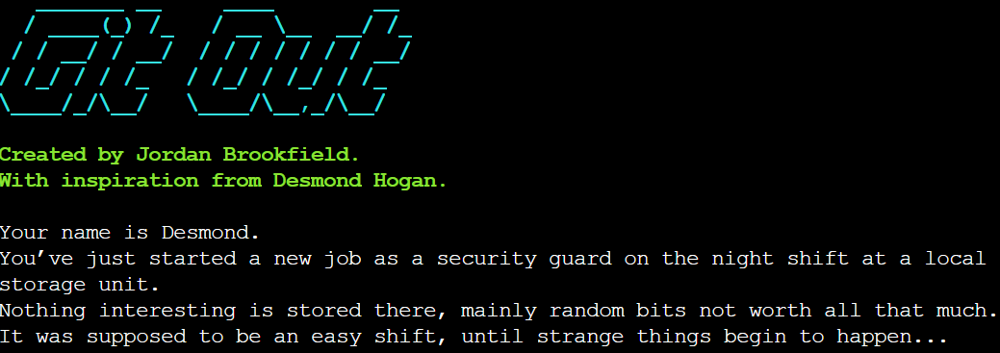

## Table of Contents
* [Purpose](#Purpose)
* [User Experience Design](#User-Experience-Design)
* [Story Map and Flow Chart](#Story-Map-and-Flow-Chart)
* [Features](#Features)
* [Technologies](#Technologies)
* [Testing](#Testing)
* [Deployment](#Deployment)
* [Credits](#Credits)

# Milestone Project 3 - GitOut, a choose your own adventure game.
## Purpose
This website was created to complete the third Milestone Project for Code Insitute's Full Stack Software Developer course. I built this from the ground up using knowledge I gained from the previous modules. These being Python and User Centric Design. The full list of technologies used can be found in the technologies section further down.

Users of this website are able to play a short story with multiple branching paths leading to either a win or a loss.

You can find the link to the live website right [here](https://git-out.herokuapp.com/).
Please note: To open any links in this document in a new browser tab, please press CTRL + Click.

***

## User Experience Design

### User Stories
#### First Time Visitor Goals
* As a First Time user, I want to easily understand the main purpose of the site.
* As a First Time user, I want a simple but effective way of making my choices while playing the game.
* As a First Time user, I want to know when my inputs are not incorrect and have another attempt.
#### Frequent Visitor Goals
* As a Frequent user, I want to clearly see how my choices are impacting the outcome of the game.
#### Returning Visitor Goals
* As a Returning user, I want to be able to play again to try for a different outcome.

## Design
#### Color Scheme
Due to this project being a simple terminal based application there was not a lot that I could do regarding the styling. I did however come across Colorama which allowed me to add some colors to parts of the text. These being Cyan, Red & Green.

*** 

## Story Map and Flow Chart
I highly recommend inspecting this 
[Google Doc](https://docs.google.com/document/d/1ghwcjxg73EdyXoCgmjsem6h2mjyTQ0Chwmcv5w3aVCk/edit?usp=sharing) to see the thought process behind creating this project. Below you will find the flow chart I created to aid in development of this application. I wrote a total of 20 text files, one for each node on the diagram.

***

## Features

### Existing Features
*  #### Title Screen
    * This section is the first thing the user is greeted with when opening the application. 
    * It clearly states the main story of the game.
    * The purpose of this is to fulfill the user story:
    > As a First Time user, I want to easily understand the main purpose of the site.

    
* #### Choice Area
    * This section is where the user will be making their decisions.
    * The section will only accept either Y or N as an input.

    
    * Another example of this can be found further into the game.
    * This section will only accept either 1, 2 or 3 as an input.

    
    * The purpose of this is to fulfill the user story:
    > As a First Time user, I want a simple but effective way of making my choices while playing the game.
* #### Error Message
    * This section informs the user that they have used the incorrect input.
    * When this happens the function they made the incorrect input on is started again, letting the user have another attempt.
    * The purpose of this is to fulfill the user story:
    > As a First Time user, I want to know when my inputs are not incorrect and have another chance.
    
    
* #### Win/Loss Screen
    * This section makes it evident to the user the outcome of the game.
    * In this instance the user has won and "You Win!" is printed to the terminal in ASCII art format.

    
    * This section makes it evident to the user the outcome of the game.
    * In this instance the user has lost and "You Lose!" is printed to the terminal in ASCII art format.

    
    * The purpose of this is to fulfill the user story:
    > As a Frequent user, I want to clearly see how my choices are impacting the outcome of the game.
* #### Retry Area
    * This section gives the user the option to have another attempt if they are not happy with the outcome. Or to just experience the other paths.
    * The purpose of this is to fulfill the user story:
    > As a Returning user, I want to be able to play again to try for a different outcome.

    

***

## Technologies

* [GitHub](https://github.com/)
    * GitHub is the hosting site I used to store the code for the website.
* [Google Docs](https://docs.google.com/)
    * Google Docs was used to write the story.
* [Heroku](https://dashboard.heroku.com/apps)
    * Heroku is the site used to deploy the project.
* [GitPod](https://gitpod.io/)
    * GitPod is the Integrated Development Environment used to develop the website in a browser.
* [Stack Overflow](https://stackoverflow.com/)
    * Stack Overflow was one of the websites used for resolving issues with code.
* [W3 Schools](https://www.w3schools.com/)
    * W3 Schools was one of the websites used for resolving issues with code.
* [PEP8 Validator](http://pep8online.com/)
    * This was used to check the Python code.
* [Patorkj](http://www.patorjk.com/software/taag/#p=display&f=Graffiti&t=Type%20Something%20)
    * This was used to convert text to ASCII art for the title, win and lose screen. 

***

## Testing

## Validator Testing
* 13 errors that were all <b>Code E501 line too long</b>. I checked each of these and all would break funcionality if the lines are shortened. All efforts were made on my part to reduce the number of these errors.

* Javascript Validator passed with no errors and 1 warning (written by Code Institute).

* HTML Validator passed with no errors or warnings (written by Code Institute).

* CSS Validator passed with no errors or warnings (written by Code Institute except where marked)

## Issues and Resolutions
* I have had an issue whenever opening a new workspace where I would have to import Colorama everytime. This is a small issue and I just resolve this by using "pip install colorama" in the terminal.

## Deployment

 This project was deployed using Code Institute's mock terminal for Heroku. The steps for deployment are as follows:
* Fork or clone this repository
* Create a new Heroku app
* Set the buildpacks to Python and NodeJS in that order
* Link the Heroku app to the repository
* Click on Deploy

***

## Credits
I'd like to thank my friend [Des Hogan](https://twitter.com/DesGames2) for the inspiration behind the story. I'd also like to thank [Rob Fairclough](https://github.com/RobFairclough) for help regarding importing the .txt files to save space in the python code. The [Code Institute Python Template](https://github.com/Code-Institute-Org/python-essentials-template) was used as a base for this project and made into my own.